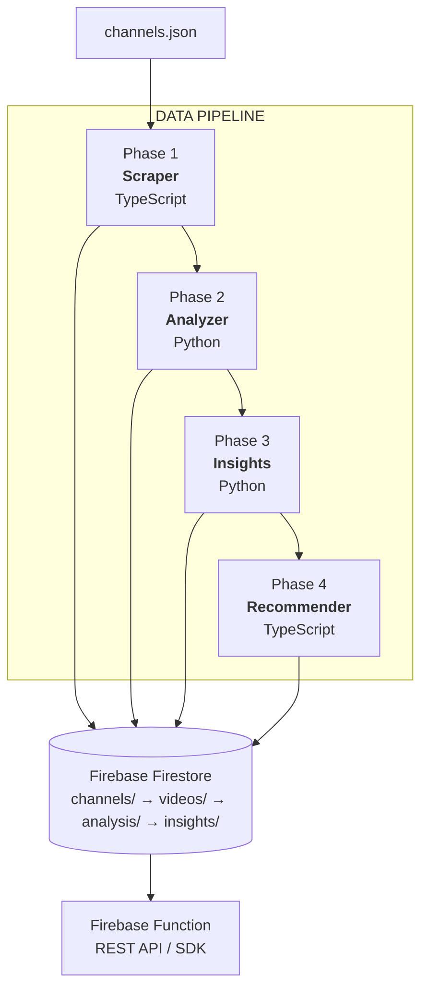

# YouTube Intelligence System

A multi-phase analytics platform that scrapes YouTube channel data, analyzes content with Gemini AI, discovers performance patterns, and generates data-driven recommendations for new video creation. Works with any YouTube channels in any language.

## What It Does

This system answers the question: **"What title, thumbnail, and posting time should I use for maximum views?"**

| Phase | Name | What it does |
|-------|------|-------------|
| 1 | **Scraper** (TypeScript) | Collects video data from YouTube API |
| 2 | **Analyzer** (Python + Gemini) | AI analysis of thumbnails and titles (2 API calls/video) |
| 3 | **Insights** (Python) | Profiles content types, compares all vs top 10% performers |
| 4 | **Recommender** (TypeScript) | Generates recommendations via CLI or REST API |



## Quick Start

### Prerequisites

- Node.js 18+ and Python 3.11+
- [YouTube Data API v3 key](https://console.cloud.google.com/apis/credentials)
- [Firebase project](https://console.firebase.google.com/) with Firestore and Storage
- [Google AI (Gemini) API key](https://aistudio.google.com/app/apikey)

### Setup

```bash
git clone https://github.com/praneeth-goparaju/youtube-intelligence.git
cd youtube-intelligence

# Configure environment
cp .env.example .env
# Edit .env with your API keys and Firebase credentials

# Install dependencies
cd scraper && npm install && cd ..
pip install -r requirements.txt
cd functions && npm install && cd ..

# Configure target channels
cp config/channels.json.example config/channels.json
# Edit config/channels.json with your YouTube channel URLs
```

### Run the Pipeline

```bash
# Phase 1: Scrape YouTube data
cd scraper && npm start

# Phase 2: Analyze with AI
cd ../analyzer && python -m src.main

# Phase 3: Generate insights
cd ../insights && python -m src.main

# Phase 4: Get recommendations
cd ../functions && npm run recommend -- --topic "Your Topic" --type recipe
```

Each phase has more options — see the README in each directory (`scraper/`, `analyzer/`, `insights/`, `functions/`) for full usage.

## Testing

```bash
cd scraper && npm test           # TypeScript tests
cd analyzer && pytest tests/     # Analyzer tests
cd insights && pytest tests/     # Insights tests
```

## Documentation

| Document | Description |
|----------|-------------|
| [Technical Documentation](docs/TECHNICAL_DOCUMENTATION.md) | System architecture and detailed features |
| [API Reference](docs/API_REFERENCE.md) | REST API and programmatic interface |
| [Deployment Guide](docs/DEPLOYMENT.md) | Production deployment and environment configuration |
| [Troubleshooting](docs/TROUBLESHOOTING.md) | Common issues and solutions |
| [Contributing](CONTRIBUTING.md) | How to contribute |
| [Security](SECURITY.md) | Vulnerability reporting and security practices |

## License

[MIT](LICENSE)
